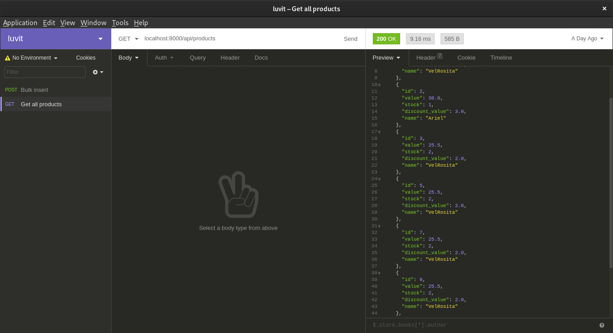
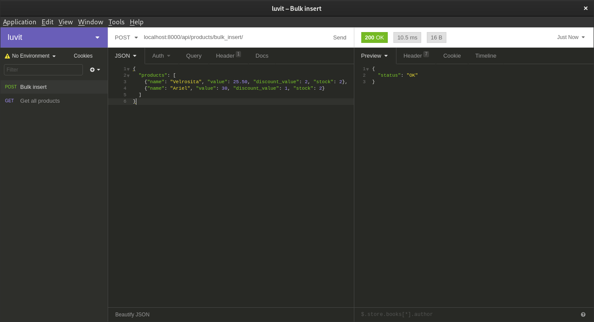
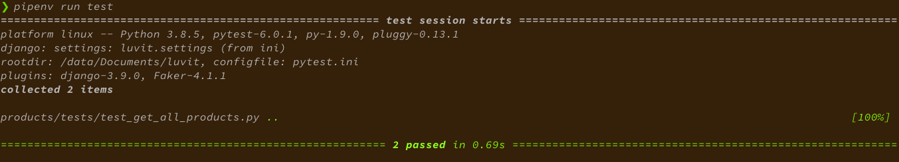

# Project luvit

A little API to serve products related endpoints.

## Setup your local environment

I used *Pipenv* to setup my local environment, you can install it with the command:

```shell
$ pip install pipenv
```

> On Linux and MacOS system you can use the command above. It's not tested in Windows

Then, when you have *Pipenv* installed in the root of this project(you have to 
clone the project first), run the command:

```shell
$ pipenv install
```

The command above installs all the requirements needed for the project.

To open and activate the virtualenv created for the project(previous command created one),
you need to run:

```shell
$ pipenv shell
```

Once you got the virtualenv activated you can test on local the project:

```shell
$ pipenv run server
```

## API docs

In this project you can find a file called **luvit-api-docs.json** whose content 
is the 2 endpoints built. They're ready to be tested at local, you only need an api 
client, Postman is the most used option, the file was created with Insomnia. Either 
options are fine. Once you have an API client, use the import option to load the file.

### Get all products

When you have running on local the project you can go to the next link [get all products](localhost:8000/api/products) or use your API client to check the endpoint.




### Bulk insert

When you have running on local the project you can go to the next link [Bulk insert](localhost:8000/api/products) or use your API client to check the endpoint.



## Run tests

First off, you need to install the development requirements in order to test the project. Run the command:

```shell
$ pipenv install --dev
```

The command installs libraries as *pytest*, *factory_boy*. Then, you can run:

```shell
$ pipenv run test
```

The test will be executed. You should the a result seems to the next image

